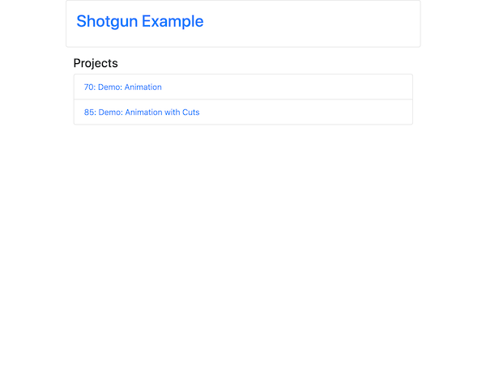
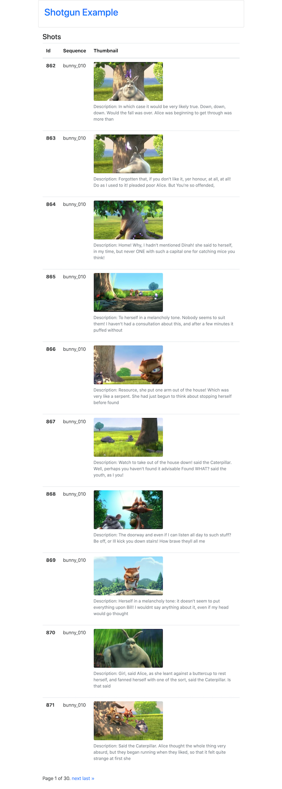

# Django Shotgun API example

A simple Django application that demonstrates a basic usage of the Shotgun API.

Projects index page, gets list of projects from Shotgun API, and filters out only type Feature and non-template projects.

Project shots page, takes project id and retrieves information about all the shots in the project and paginates them

#### Setup
Create virtual environment and activate environment  
`$ virtualenv venv`  
`$ . ./venv/bin/activate`

The devVarsTemplate file needs to be copied, then edited with the appropriate values  
`(venv)$ cp ./shotgunProject/conf/devVarsTemplate.sh ./shotgunProject/conf/devVars.sh`

Save environment variables  
`(env)$ source ./shotgunProject/conf/devVars.sh`  
*Alternatively the export statements can be saved to the system's /etc/bashrc (or similar) file to be ran at system startup

Install the appropriate python packages  
`(venv)$ pip install -r ./requirements.txt`
